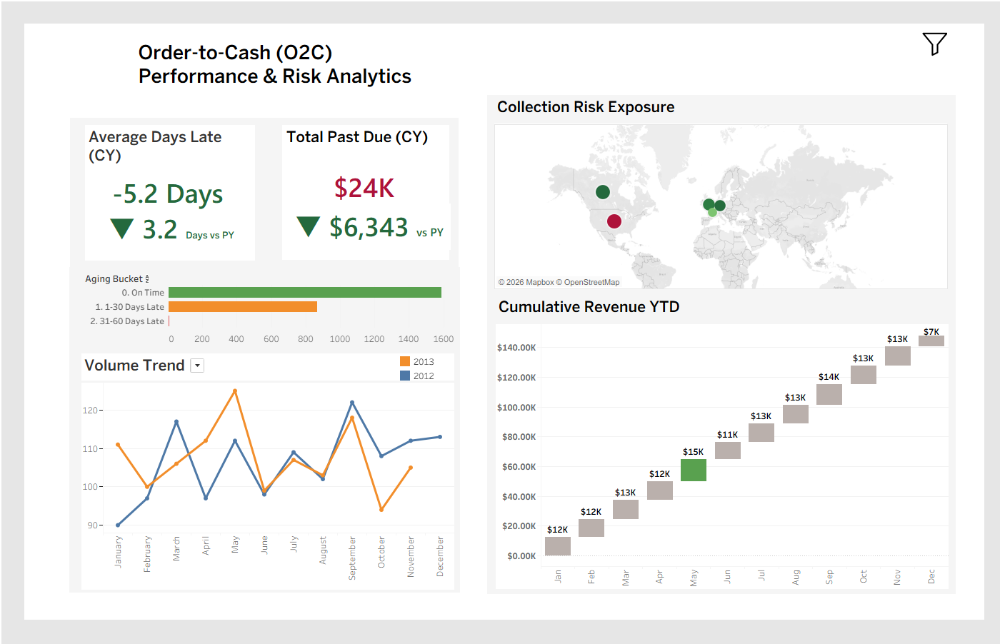

# 📊 Order-to-Cash (O2C) Performance & Risk Analytics

## Executive Summary
This project is an enterprise-grade analytics tool designed to monitor and mitigate capital exposure (outstanding receivables). The dashboard transforms raw billing data into a strategic decision-making engine, enabling financial leadership (CFOs / Financial Controllers) to identify liquidity risk hotspots and take proactive measures before debts become uncollectible.

## Dashboard Preview

## The Business Problem
Cash flow bottlenecks are a primary driver of operational failure. The organization required absolute visibility into three critical areas:
1. What is the total volume of capital at risk (Past Due) in the current year?
2. Which geographic regions are generating this systemic risk?
3. How does the current collection velocity compare to the previous year's performance (YoY)?

## The Solution & Strategic Value
I engineered an interactive visual ecosystem that goes beyond reporting to drive targeted business action:
* **Geographic Risk Isolation:** The exposure map instantly highlights critical risk markets (e.g., the United States), allowing for the reallocation of collection efforts to where the ROI is maximized.
* **Aging Bucket Analysis:** Segments outstanding debt into urgency tiers (1-30 Days Late vs. 31-60 Days Late), facilitating a surgical triage of clients for the accounts receivable team.
* **Macro-Performance vs. Isolated Risk:** Enables decision-makers to see that while global performance has improved (a YoY decrease in average days late), there are still isolated pockets of absolute risk (trapped capital) that require immediate credit restriction policies.

## Technical Architecture & Mechanics (Tableau)
This dashboard relies on advanced mechanics to ensure data integrity and a bulletproof filtering experience, far beyond standard drag-and-drop visualizations:
* **Advanced Dashboard Actions (Selective Filtering):** Configured directional filter actions. When a user selects a specific month on the Trend chart, the interface selectively isolates that month while retaining both years in the underlying calculation, preventing the destruction of Year-over-Year (YoY) variance equations.
* **Level of Detail (LOD) Expressions:** Implemented `FIXED` functions to anchor denominators in risk ratios, ensuring financial metrics do not break or skew when interacting with cross-filtering across the dashboard.
* **Data Cleansing & Integrity:** Eliminated source-level anomalies (e.g., excluding incomplete end-of-year data from trend axes) to prevent false strategic interpretations, thereby protecting the credibility of the decision-making process.
* **Enterprise-Grade UI/UX:** Enforced strict visual hierarchy. Conditional colors (Red/Green) are exclusively reserved for comparative performance, while absolute risk exposure is maintained in a neutral format to prevent cognitive overload and decision bias. Custom numerical formatting (K-scaling, directional indicators) was applied for executive readability.

## How to Use
1. Download the `.twbx` (Tableau Packaged Workbook) file from this repository.
2. Open it using **Tableau Desktop** or **Tableau Reader**.
3. Interact with the Geographic Map or the Trend lines to see the selective filtering dynamically update the primary KPIs.
